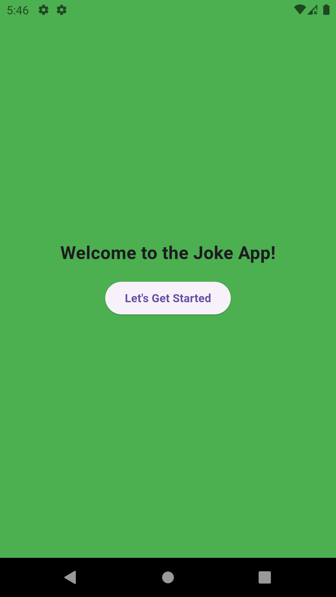
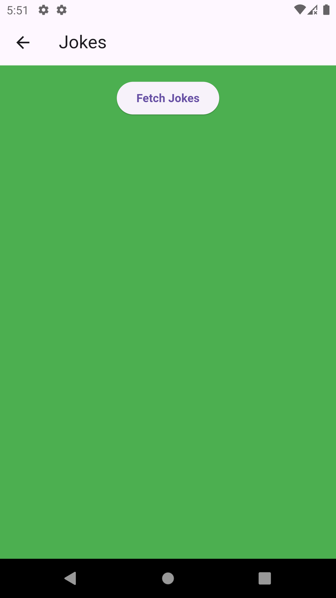
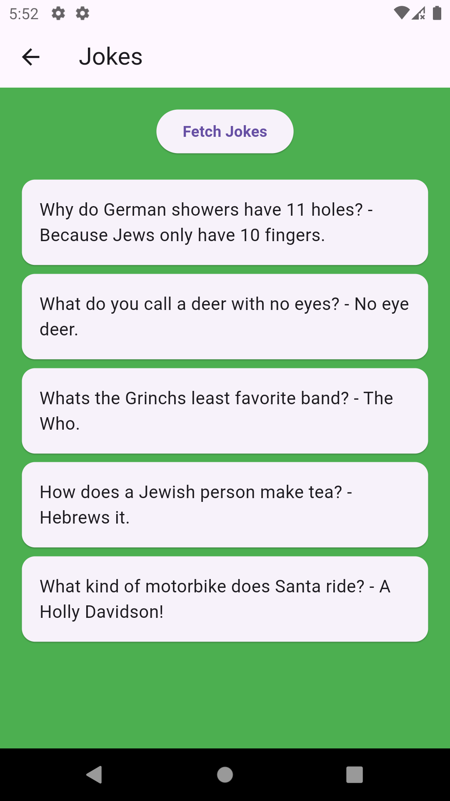

# mini_project_jokes_app
Flutter Project

A simple Flutter application that fetches and displays jokes. The app contains two pages:

- **Home Page**: A welcome screen with a "Let's Get Started" button that navigates to the next page.
- **Joke List Page**: Displays a list of jokes fetched from an API with the ability to fetch new jokes by pressing the "Fetch Jokes" button.

## Features

- Display a list of jokes.
- Fetch jokes from an API when the user presses the "Fetch Jokes" button.
- Clean UI with a green background.
- Display loading indicator while jokes are being fetched.

## Screenshots




## Getting Started

To run this project locally, follow these steps:

### Prerequisites

- [Flutter SDK](https://flutter.dev/docs/get-started/install) (Make sure it's installed and set up on your system)
- An editor like [VS Code](https://code.visualstudio.com/) or [Android Studio](https://developer.android.com/studio)
- A physical or virtual Android/iOS device for testing

### Installation

1. Clone this repository to your local machine:

   ```bash
   git clone https://github.com/Pramudi99/mini_project_jokes_app.git

